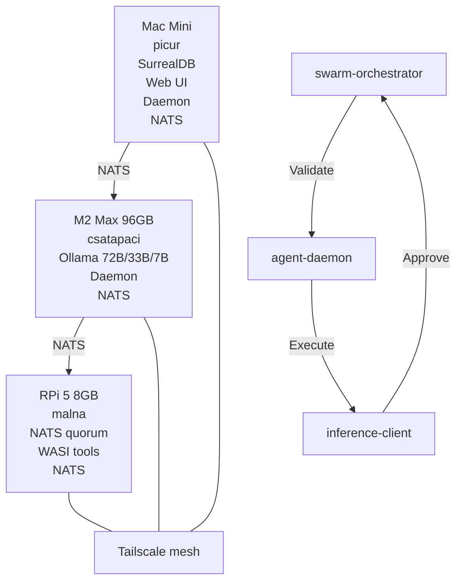

# alpha-swarm

Distributed AI agent orchestration system. Multiple LLM-powered agents work on code repositories in parallel, coordinated via NATS and wasmCloud.

## Architecture

The architecture of alpha-swarm has been updated to include a gated autonomous loop, which ensures that all actions are validated and approved before execution. This loop involves the swarm-orchestrator, agent-daemon, and inference-client, working together to manage tasks and ensure system integrity.



### Gated Autonomous Loop

The gated autonomous loop is a critical component of alpha-swarm's architecture. It ensures that all tasks are validated and approved before execution, enhancing the system's reliability and security. The loop involves the following steps:

1. **Task Decomposition**: The swarm-orchestrator decomposes high-level goals into parallel sub-tasks.
2. **Task Validation**: The agent-daemon validates each task to ensure it meets the system's requirements.
3. **Task Execution**: The agent-daemon executes the validated tasks.
4. **Result Approval**: The inference-client approves the results of the executed tasks, ensuring they are correct and secure.
5. **Feedback Loop**: The approved results are fed back into the swarm-orchestrator for further task decomposition and execution.

## Dashboard

The dashboard is accessible at `http://localhost:8001` and features a 3D graph that visualizes the system's architecture and task flow.

## Components

### Agent System
- **agent-daemon** — Task executor. Picks up tasks via NATS KV, runs planning + agents, creates PRs.
- **agent-core** — One-shot code modification agent. Reads files, calls LLM, parses edits, applies them.
- **swarm-orchestrator** — Decomposes goals into parallel sub-tasks, manages git worktrees, merges results.

### Inference
- **inference-client** — Multi-backend router (Ollama + Claude). Model selection by complexity tier. Native tool calling support.
- Chat: MLX (mlx_lm.server) on csatapaci — qwen2.5-coder 14B (planner/worker) + 32B (refactor escalation)
- Embeddings: malna (RPi 5) via Ollama nomic-embed-text (768-dim)

### Tools (15 built-in)
- **Filesystem**: read_file, write_file, delete_file, list_files
- **Search**: grep (ripgrep), ts_find, ts_signatures (tree-sitter AST)
- **Code**: ts_rename (AST-aware rename)
- **Testing**: run_tests (auto-detect cargo/npm/go)
- **Git**: git_diff, git_status
- **Web**: web_search (DuckDuckGo), fetch_url, search_crates (crates.io)
- **Shell**: run_command (allowlisted)

### Infrastructure
- **NATS** — 3-node cluster for task coordination (KV), events (pub/sub), tool dispatch
- **SurrealDB** — Persistent storage for runs, plans, metrics, embeddings
- **Tailscale** — Mesh VPN connecting all machines

### Providers (native, NATS services)
- **git-provider** — Git clone, worktree, branch, commit, push, PR creation
- **test-provider** — cargo test, npm test, go test execution

### WASI Components
- **web-ui** — Dashboard (Leptos/Rust WASM frontend)
- **tool-search** — Tree-sitter + grep (sandboxed, 233KB)
- **tool-web** — Web search + URL fetch (HTTP-only, 249KB)

## Quick Start

```bash
# Prerequisites: Rust nightly, Ollama, NATS, SurrealDB, Tailscale

# Build everything
cargo build --release

# Start SurrealDB
surreal start --bind 0.0.0.0:8001 --user root --pass root file:data

# Start services
./target/release/agent-daemon &
NATS_URL=nats://127.0.0.1:4223 ./target/release/git-provider &
NATS_URL=nats://127.0.0.1:4223 ./target/release/test-provider &

# Start web UI
cd components/web-ui && wash dev --non-interactive &
cd frontend && trunk serve --address 0.0.0.0 &

# Open dashboard
open http://localhost:3000
```

## Configuration

`alpha-swarm.toml` in the working directory:

```toml
[ollama]
url = "http://127.0.0.1:11434"

[surrealdb]
url = "127.0.0.1:8001"

[nats]
url = "nats://127.0.0.1:4223"

[tiers.orchestrator]
model = "qwen2.5:72b"

[tiers.agent]
model = "deepseek-coder:33b"

[tiers.worker]
model = "qwen2.5-coder:7b"
```

See [docs/DEPLOYMENT.md](docs/DEPLOYMENT.md) for multi-machine setup.

## Documentation

- [PLAN.md](docs/PLAN.md) — Phased implementation plan (0-10)
- [DEPLOYMENT.md](docs/DEPLOYMENT.md) — Multi-machine deployment guide
- [INFRASTRUCTURE.md](docs/INFRASTRUCTURE.md) — System architecture

## License

Apache-2.0
