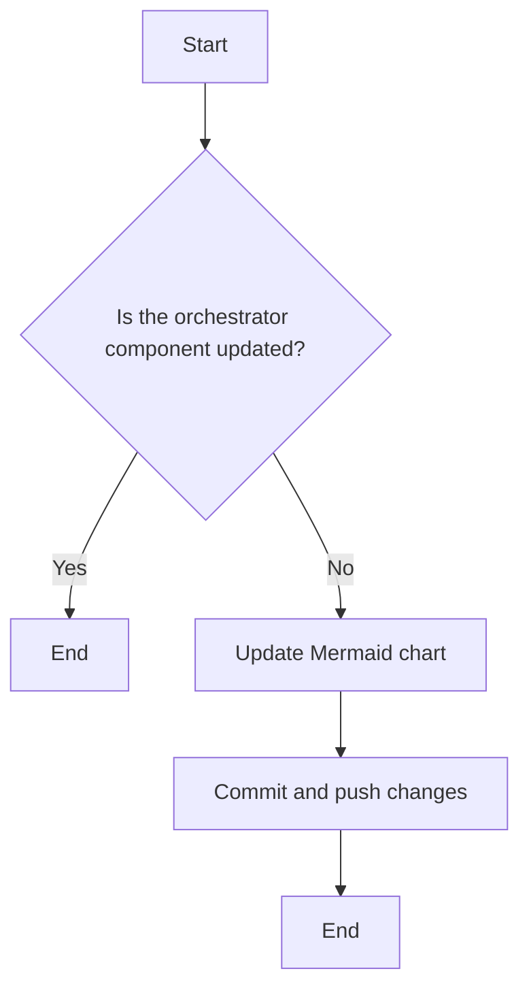

--- OLD

```mermaid
graph TB
    A[Start] --> B{Is the orchestrator component updated?}
    B -->|Yes| C[End]
    B -->|No| D[Update Mermaid chart]
    D --> E[Commit and push changes]
    E --> F[End]
```